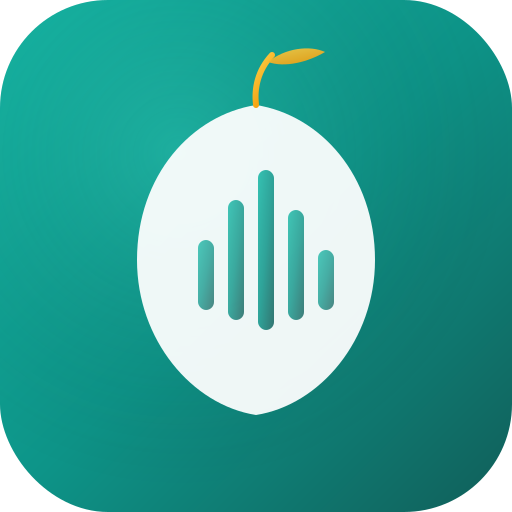

<p align="center">
  
</p>

<h1 align="center">Tuffahi <sub>تُفَّاحِي</sub></h1>

<p align="center">
  An <strong>unofficial</strong> cross-platform Apple Music client built with <strong>Electron</strong>, <strong>SolidJS</strong>, and <strong>MusicKit JS</strong>.
</p>

> **Disclaimer:** This is an unofficial third-party client. Not affiliated with or endorsed by Apple Inc. Requires an Apple Music subscription.

## Features

- Browse Apple Music catalog (Top Charts, Featured Playlists, Genres)
- Search for songs, albums, artists, and playlists
- Access your Apple Music library (songs, albums, playlists, recently added)
- Full playback controls with progress bar, volume, shuffle, and repeat
- Mini player mode (compact always-on-top window)
- Now Playing view with large artwork display
- Queue management
- Audio quality selection (Standard 64 kbps / High 256 kbps)
- Discord Rich Presence integration
- Customizable themes
- System tray integration with quick controls
- Keyboard shortcuts for media control
- Song ratings (love/dislike)
- Sleep timer
- Play history tracking
- Cross-platform support (Linux, macOS, Windows)

## Prerequisites

- [Node.js](https://nodejs.org/) (v18+)
- An [Apple Developer account](https://developer.apple.com/) with a MusicKit key

## Setup

1. Clone the repository:
```bash
git clone https://github.com/salamaashoush/tuffahi.git
cd tuffahi
```

2. Install dependencies:
```bash
npm install
```

3. Configure MusicKit credentials:

Copy `.env.example` to `.env` and fill in your Apple Developer credentials:
```bash
cp .env.example .env
```

You need:
- **Team ID** — Found in Apple Developer Portal under Membership
- **Key ID** — Generated when creating a MusicKit key
- **Private Key (.p8)** — Downloaded when creating the MusicKit key

See [Apple's MusicKit documentation](https://developer.apple.com/documentation/applemusicapi/getting_keys_and_creating_tokens) for details.

## Development

Run the app in development mode:
```bash
npm run dev
```

This starts the Electron app with Vite HMR for the renderer process.

## Building

Build the application:
```bash
npm run build
```

Package for distribution:
```bash
npm run package
```

Output formats by platform:
- **Linux** — AppImage, .deb
- **macOS** — .dmg
- **Windows** — NSIS installer

## Project Structure

```
tuffahi/
├── electron/
│   ├── main/               # Main process (Node.js)
│   │   ├── index.ts        # App lifecycle, windows, tray
│   │   ├── ipc-handlers.ts # IPC handler registrations
│   │   ├── auth-window.ts  # Apple auth flow
│   │   ├── token.ts        # JWT developer token (ES256)
│   │   └── discord.ts      # Discord RPC
│   └── preload/
│       └── index.ts        # contextBridge API
├── src/                     # Renderer (SolidJS)
│   ├── components/          # UI components
│   │   ├── Player/          # Playback controls
│   │   ├── NowPlaying/      # Full-screen now playing
│   │   ├── MiniPlayer/      # Compact player window
│   │   ├── Library/         # User library views
│   │   ├── Browse/          # Catalog & search
│   │   ├── Queue/           # Queue panel
│   │   ├── Settings/        # App settings
│   │   ├── Sidebar/         # Navigation
│   │   └── ...
│   ├── stores/              # SolidJS reactive stores
│   ├── hooks/               # Custom hooks
│   ├── services/            # API, cache, storage, Discord
│   ├── lib/                 # MusicKit utilities
│   ├── types/               # TypeScript type definitions
│   └── styles/              # Global CSS
├── resources/               # App icons
├── electron.vite.config.ts  # Build config (main, preload, renderer)
├── electron-builder.yml     # Packaging config
└── package.json
```

## Keyboard Shortcuts

| Shortcut | Action |
|----------|--------|
| `Space` | Play / Pause |
| `Ctrl + →` | Next track |
| `Ctrl + ←` | Previous track |
| `Ctrl + ↑` | Volume up |
| `Ctrl + ↓` | Volume down |
| `Ctrl + M` | Mute / Unmute |

## Architecture

```
┌──────────────────────────────────────────────────────────┐
│                     Electron Shell                        │
│                                                          │
│  ┌────────────────────────────────────────────────────┐  │
│  │              Renderer (SolidJS + Vite)             │  │
│  │                                                    │  │
│  │  ┌──────────┐  ┌──────────┐  ┌───────────────┐   │  │
│  │  │  Player  │  │ Library  │  │ Browse/Search │   │  │
│  │  │ Controls │  │  Views   │  │    Views      │   │  │
│  │  └──────────┘  └──────────┘  └───────────────┘   │  │
│  │                       │                           │  │
│  │            ┌──────────┴──────────┐                │  │
│  │            │    MusicKit JS      │                │  │
│  │            │  (Audio Playback)   │                │  │
│  │            └─────────────────────┘                │  │
│  └───────────────────────┬────────────────────────────┘  │
│                          │ IPC (contextBridge)           │
│  ┌───────────────────────┴────────────────────────────┐  │
│  │                  Main Process                       │  │
│  │  • Developer Token (JWT/ES256)                      │  │
│  │  • Apple auth window                                │  │
│  │  • System tray & window management                  │  │
│  │  • Discord Rich Presence                            │  │
│  │  • Auto-launch & close behavior                     │  │
│  └────────────────────────────────────────────────────┘  │
└──────────────────────────────────────────────────────────┘
```

## DRM / Widevine

This project uses the [Castlabs Electron fork](https://github.com/nicedoc/nicedoc.io) which includes Widevine CDM support for DRM-protected content playback.

## License

MIT
