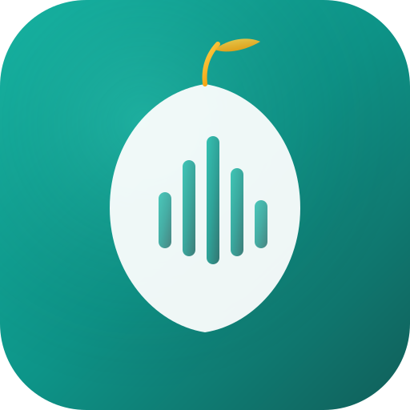

<p align="center">
  
</p>

<h1 align="center">Tuffahi <sub>تُفَّاحِي</sub></h1>

<p align="center">
  An <strong>unofficial</strong> cross-platform Apple Music client built with <strong>Electron</strong>, <strong>SolidJS</strong>, and <strong>MusicKit JS</strong>.
</p>

> **Disclaimer:** Unofficial third-party client. Not affiliated with or endorsed by Apple Inc. Requires an Apple Music subscription.

## Features

- Browse the Apple Music catalog (charts, genres, curators, featured playlists)
- Search songs, albums, artists, playlists
- Your library (songs, albums, artists, playlists, recently added)
- Full playback: progress, volume, shuffle, repeat, queue, mini player
- Now Playing with ambient artwork backdrop & synced lyrics
- Session persistence (queue/position resume after restart)
- Song ratings (love / dislike), share links
- Discord Rich Presence, system tray, media keys, sleep timer
- Customizable themes
- Linux & Windows builds

## Install (prebuilt, Linux)

```bash
curl -fsSL https://raw.githubusercontent.com/salamaashoush/tuffahi/main/scripts/install.sh | bash
```

Auto-picks `.pacman` (Arch), `.deb` (Debian/Ubuntu) or `.AppImage`.
Windows: download the `-setup.exe` from the
[latest release](https://github.com/salamaashoush/tuffahi/releases/latest).

> macOS is not built — Apple ships a native Apple Music app.

## Build from source

Prerequisites: [Bun](https://bun.sh), an
[Apple Developer account](https://developer.apple.com/) with a MusicKit key.

```bash
git clone https://github.com/salamaashoush/tuffahi.git
cd tuffahi
bun install
# Bun skips lifecycle scripts — fetch the Castlabs (Widevine) Electron binary:
node node_modules/electron/install.js
cp .env.example .env   # then fill APPLE_TEAM_ID, APPLE_KEY_ID, APPLE_PRIVATE_KEY_PATH
```

MusicKit credentials (Apple Developer Portal → Membership / MusicKit key):
**Team ID**, **Key ID**, **Private Key (.p8)**. See
[Apple's docs](https://developer.apple.com/documentation/applemusicapi/getting_keys_and_creating_tokens).

```bash
bun run dev        # dev with HMR
bun run build      # production build
bun run package    # build + electron-builder installers
```

Releases are tag-driven via GitHub Actions — see [RELEASING.md](RELEASING.md).

## Project structure

```
electron/main      App lifecycle, windows, tray, IPC, JWT token, Discord
electron/preload   contextBridge API
src/components      SolidJS UI (Player, NowPlaying, Library, Browse, …)
src/stores          Reactive stores (musickit, player, library, ratings)
src/services        API, cache, storage, Discord, logger
src/lib             MusicKit helpers
electron-builder.yml  Packaging   ·   electron.vite.config.ts  Build
```

## Keyboard shortcuts

| Shortcut | Action |
|----------|--------|
| `Space` | Play / Pause |
| `Ctrl + →` / `Ctrl + ←` | Next / Previous |
| `Ctrl + ↑` / `Ctrl + ↓` | Volume up / down |
| `Ctrl + M` | Mute |

## DRM / Widevine

Uses the [Castlabs Electron fork](https://github.com/castlabs/electron-releases)
(Widevine CDM) for DRM-protected playback.

## License

MIT
